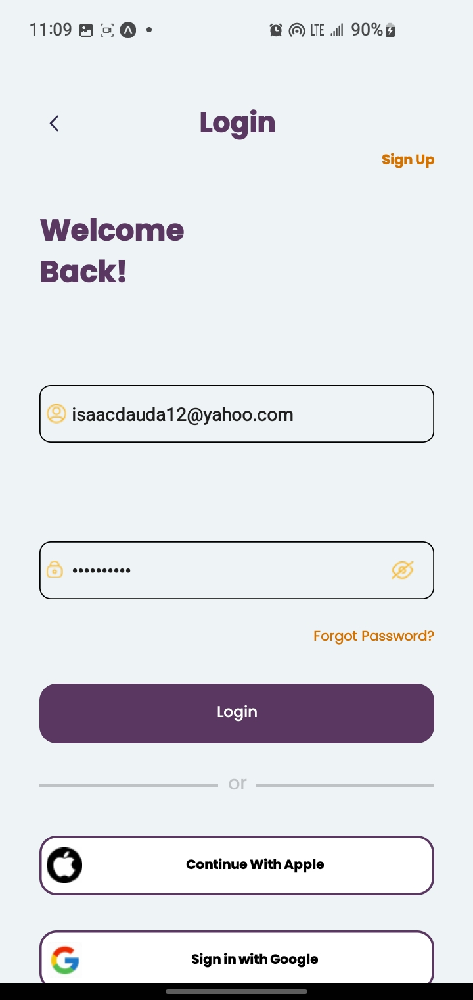

# Moovers

# Movers is a dynamic logistics app designed to simplify the process of relocation and transportation. Whether you're moving your personal belongings or require efficient transportation for goods of any size, Movers has you covered. With a user-friendly interface and intuitive features, the app empowers users to seamlessly book trucks for their moving needs.
# Experience hassle-free booking as Movers connects you with an array of available trucks, ensuring that your items are transported safely and efficiently. The app's innovative tracking system allows you to monitor the real-time location of your goods, offering peace of mind and transparency throughout the entire journey.

# Whether you're moving locally or over longer distances, Movers streamlines the logistics process by providing a reliable platform that brings together users and transport services. Say goodbye to the complexities of arranging transportation – Movers is here to make your moving experience smooth, reliable, and stress-free."

 

